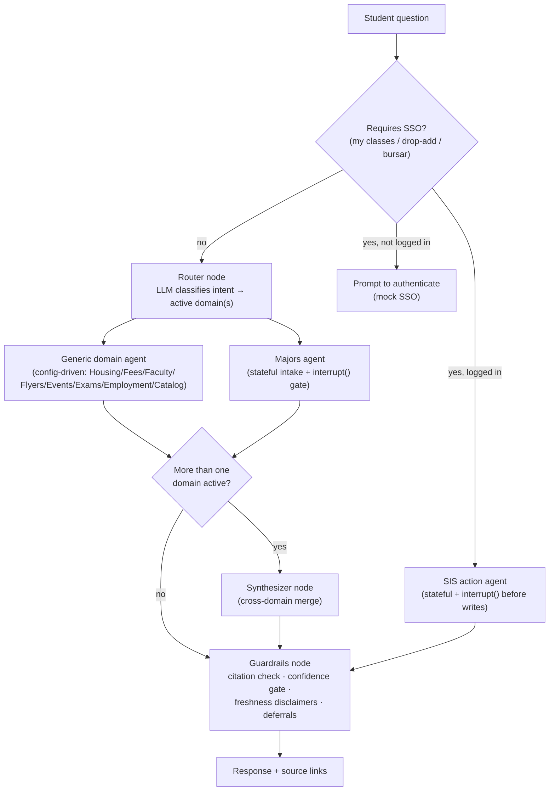

# TigerMind — Project Plan (v4)

> v4: expanded scope from 6 to 10 domains per the user's actual product
> vision (housing, majors, programs, faculty, flyers, student employment,
> events, exams/deadlines, fees, plus a Phase 6 SSO-gated "my classes /
> drop-add / bursar" agentic tier). Replaces the one-agent-per-domain shape
> with a **generic, config-driven retrieval agent** for every simple public
> domain, reserving bespoke agent code for the two cases that actually need
> it: Majors (stateful advising) and SIS actions (stateful + human-in-the-
> loop write actions). Adds explicit scalability/reproducibility and
> portfolio-positioning sections per the project's primary goal: a resume
> piece for software/AI engineering roles.
>
> Commit this as `PLAN.md` in the repo root. `CLAUDE.md` points here for
> full context — read the relevant phase section before starting work.

---

## 1. Why This Project

Ranked by what actually matters here:

1. **Portfolio piece for software/AI engineering roles.** This is the
   primary goal. Every architectural choice below is filtered through "does
   this teach/demonstrate something a hiring manager for a SWE or AI
   engineering role would care about," not "what's the coolest thing to
   build." See Section 12 for how this is meant to read in an interview.
2. **Close the LangGraph gap with a second, honest data point.** An earlier
   project (Integrated Patient System) has real multi-agent orchestration,
   but it's hand-rolled. This project proves the same pattern in an actual
   framework — state, conditional routing, checkpointing, and (new in v4)
   `interrupt()`-gated actions, not just retrieval.
3. **A useful tool for a real audience** (University of Memphis students)
   using real, publicly available university data — makes the eval story
   concrete instead of synthetic.

Same instinct as the patient system: build something, test it against real
questions, find where it breaks, fix it, document the fix.

---

## 2. What Actually Has to Be True

These must be load-bearing, not decorative — see
`.claude/rules/langgraph-checklist.md`:

- [ ] A checkpointer persists the Majors agent's intake state across turns.
- [ ] Conditional edges genuinely change the graph's shape based on router
      output (single-domain vs. multi-domain vs. action-request).
- [ ] `interrupt()` gates the Majors GPA/prereq recommendation **and** any
      Phase 6 drop/add action — this is no longer a stretch goal. An agent
      that can take real actions but pauses for human confirmation before
      anything irreversible is the actual differentiator of this project.

---

## 3. System Overview — Three Tiers, Not One Agent Per Domain

Eight of the ten domains are structurally identical: retrieve from a
domain-scoped Chroma collection, cite sources, answer. Hand-writing eight
near-duplicate LangGraph nodes for that is both bad engineering (violates
DRY for no reason) and a worse portfolio story ("copy-pasted the same agent
eight times" vs. "built one configurable agent and scaled it to eight
domains via config"). So:

| Tier | Domains | Shape | Why bespoke code (or not) |
|---|---|---|---|
| **1 — Generic retrieval agent** | Housing, Fees, Faculty, Flyers, Events, Exams/Deadlines, Student Employment, Course Catalog | One function, parameterized by a domain config entry (collection name, retrieval mode, prompt snippet) | No new logic per domain — adding a domain means running ingestion + adding one config entry, not writing an agent |
| **2 — Majors (flagship)** | Majors advising | Stateful multi-turn intake + recommendation | The only public-info domain where the *process* (declare vs. apply, GPA/prereq eligibility) requires state held across turns — this is what justifies LangGraph's state primitives in Tier 1's absence |
| **3 — SIS actions (Phase 6, SSO-gated)** | My classes, drop/add, bursar balance | Stateful + agent takes real write actions | The only tier where the agent *does* something instead of *answering* something — requires auth, a confirm-before-execute HITL gate, and is explicitly the last phase built |

Note the distinction inside "Majors": *"What majors does UofM offer / what
does X major cover"* is a Tier 1 factual lookup (folds into the generic
agent against a `programs` collection). *"Help me figure out which major
to pick / can I get into a competitive major"* is the Tier 2 stateful flow.
Don't conflate them — most Majors questions are actually Tier 1.

---

## 4. Domains

| Domain | Tier | Retrieval | Notes |
|---|---|---|---|
| Housing | 1 | Semantic | Rates, hall types, contract policies, move-in/out dates |
| Fees / Financial | 1 | **Hybrid** | Fee charts, payment guidelines, financial aid, and payment deadlines — Exams/Deadlines owns academic dates only. Reclassified from Semantic in Phase 2: a named fee is an exact-match lookup, fee policy is prose |
| Faculty Directory | 1 | Structured | Per-department: who teaches what, office hours, contact |
| Flyers / Announcements | 1 | Semantic | Short TTL — freshness-critical, see Section 7 |
| Events | 1 | Semantic + dates | Freshness-critical |
| Exams / Deadlines | 1 | Structured | Academic calendar; freshness-critical |
| Student Employment | 1 | Semantic | On-campus jobs, work-study postings |
| Course Catalog / Programs listing | 1 | Hybrid | Course codes = structured; program descriptions = semantic. **Blocked — see 17.12.** `catalog.memphis.edu` sits behind an AWS WAF JS challenge and the Banner alternative is not publicly reachable |
| **Majors advising** | **2** | Stateful + semantic | Declare vs. apply, GPA/prereq eligibility, per-college process |
| **My Classes / Drop-Add / Bursar** | **3** | Stateful + action | Phase 6 only. Mocked SSO + SIS — see Section 8 |

---

## 5. Architecture

The router returns the *list* of active Tier-1/Tier-2 domains; the
synthesizer fires only when that list has more than one entry. Tier-3 (SIS)
requests short-circuit straight to the SIS action agent after an auth
check, bypass the multi-domain synthesizer, but still pass through
guardrails before returning.

---

## 6. Retrieval Strategy

- **Structured lookup** (keyword/regex before falling back to embeddings):
  course codes, faculty names, exam dates.
- **Semantic RAG**: Housing, Flyers, Events, Student Employment,
  Majors process text.
- **Hybrid**: Fees (a named fee → its amount is exact-match; "how does the
  payment plan work" is prose) and Course Catalog (course-code queries →
  structured; "how do I
  withdraw" style → semantic).

---

## 7. Data Freshness

Two freshness tiers, not one:

- **Slow-changing** (Housing rates, Fee charts, Faculty directory,
  Program descriptions): re-ingest on a manual cadence (documented in
  README once ingestion exists), `last_updated` metadata on every chunk.
- **Fast-changing** (Flyers, Events, Exams/Deadlines): short TTL metadata;
  guardrails append a "confirm this is still current" note more
  aggressively for these domains, and ingestion for these should be rerun
  far more often than the slow tier.

Guardrails always append a freshness disclaimer to any answer citing a
date or dollar amount, regardless of tier.

---

## 8. Auth / SIS Design (Phase 6)

There is no real, integrable University of Memphis SSO/SIS/Bursar API
available for a personal project. Phase 6 is explicitly a **mocked SIS**:

- A small FastAPI service (`backend/app/mock_sis/`) backed by SQLite, with
  a handful of seeded fake students, enrollments, and bursar balances.
- Mock login (email/password) issuing a JWT — exercises a real auth flow
  and authorization checks (a student can only see/modify their own
  records) without touching any real institutional system.
- The agent calls this mock service exactly like it would call a real
  registrar API, so the integration *pattern* is real even though the data
  isn't.
- **Honesty constraint:** the README/portfolio writeup must say this
  simulates the SSO/SIS integration pattern — never imply it's live-
  connected to UofM's actual student system.
- Drop/add is the one write action in the whole project. It must go
  through `interrupt()`: the agent proposes the action, the student
  confirms, only then does it execute against the mock SIS. This is the
  headline "agentic AI done safely" story for the resume.

---

## 9. Scalability & Reproducibility

- **Config-driven domains**: a single `backend/app/config/domains.yaml`
  (or `.py` dict) registry — collection name, retrieval mode, prompt
  snippet, freshness tier — is the only thing that changes to add a Tier-1
  domain. No new agent code.
- **Reproducible environment**: `docker-compose.yml` bringing up the
  FastAPI backend, Chroma persistence volume, and (Phase 6) the mock SIS
  service together. Pinned `requirements.txt`. `.env.example` stays the
  single source of truth for required config.
- **Idempotent ingestion**: re-running a domain's ingestion script should
  be safe to run repeatedly (upsert by content hash, not append).
- **CI gate**: GitHub Actions runs `eval/run_eval.py` against the relevant
  eval subset on every PR and blocks merge on failure — the eval subset
  passing is the Definition of Done for a phase, enforced automatically
  rather than relying on remembering to run it locally.

---

## 10. Engineering Conventions

- One generic domain-agent function, not one function per domain — see
  Section 3. If a "specialist" starts accumulating domain-specific
  branches, that's a signal it belongs in Tier 2/3, not a config entry.
- Small, single-responsibility node functions; typed Pydantic state
  schemas for every graph's state.
- No dead code, no speculative abstractions for domains that don't exist
  yet — add the fourth generic domain by adding a config entry, not by
  refactoring in anticipation of it.
- No comments explaining *what* code does — only the non-obvious *why*
  (e.g., why drop/add must go through `interrupt()`).
- **No hardcoding — config/data over code branches.** Anything that
  differs per domain (source URLs, retrieval mode, prompt snippet,
  freshness tier) lives in `backend/app/config/domains.yaml`, never as a
  literal baked into Python logic. This includes per-department Faculty
  source URLs and per-domain eval expectations — they're config *data*,
  not hardcoded control flow, so adding one is an edit to a file a
  non-engineer could read, not a code change.
- **Minimize dependencies.** Before adding a new package, check whether
  something already in `PLAN.md` §11's stack covers the need. Don't add a
  second HTTP client, a second PDF library, etc. `playwright` is the
  running example: flagged as conditional on Events' ingestion spike,
  not added speculatively just because it might be needed.

---

## 11. Tech Stack

Full reasoning per choice lives in `CLAUDE.md`. Summary:

| Layer | Choice |
|---|---|
| Backend | FastAPI |
| Orchestration | LangGraph (StateGraph, conditional edges, checkpointer, `interrupt()`) |
| LLM | Anthropic Claude API — tiered by role (Haiku for mechanical ingestion/guardrails, Sonnet for retrieval/synthesis, Opus for the router's judgment call) |
| Vector store | Chroma, domain-scoped collections |
| Embeddings | Local `sentence-transformers` |
| Mock SIS (Phase 6) | FastAPI + SQLite + JWT auth |
| Frontend | React (reused chat component) |
| Reproducibility | Docker Compose, pinned deps, GitHub Actions eval gate |

### Ingestion / parsing (added after Phase 0 findings)

Phase 0 research used an AI-summarizing fetch tool — fine for reconnaissance,
wrong for ingestion. The actual ingestion pipeline must hit raw HTML/PDF with
a deterministic parser, never an LLM paraphrase of the source page, or the
"ground truth" chunks going into Chroma are already a lossy model
interpretation — quietly undermining the citation-grounded premise the
guardrails design depends on.

| Addition | For |
|---|---|
| `httpx` | Deterministic HTTP fetching for ingestion (all 8 Tier-1 domains) |
| `beautifulsoup4` | HTML parsing |
| `pdfplumber` | PDF table extraction — confirmed needed for Fees (rate schedules are PDF-only), possibly Course Catalog if it offers a bulk PDF export |
| `playwright` *(conditional — don't add until confirmed needed)* | Only if Events' Phase 1/2 spike finds no iCal feed or JSON API behind `/calendar/` and a headless render is the only option. Prefer iCal → JSON API → Playwright, in that order, per the Engineering Conventions rule against premature dependencies |

---

## 12. Real Data Sources

| Domain | Source |
|---|---|
| Housing | `memphis.edu/reslife` |
| Fees / Financial | `memphis.edu/usbs`, `memphis.edu/financialaid/consumer_info.php` |
| Course Catalog / Programs | `catalog.memphis.edu` |
| Majors advising | Per-college advising pages + `umdegree.memphis.edu` |
| Faculty | Each department's public directory page |
| Flyers / Announcements | Campus news / department announcement pages |
| Events | `memphis.edu/events` (or campus calendar equivalent) |
| Exams / Deadlines | Registrar academic calendar |
| Student Employment | Campus jobs portal / work-study postings |
| My Classes / Drop-Add / Bursar | N/A — mocked, see Section 8 |

---

## 13. Build Sequence

Each phase is a natural `/clear` boundary and a natural git branch (see
`.claude/rules/git-workflow.md`).

### Phase 0 — Domain Reconnaissance (2-3 days)
For each Tier-1 domain: source format, 5-10 real student questions, data
complications, proposed retrieval mode. Lighter per-domain than v3 since
they all feed the same generic agent — deliverable is still
`docs/domain-research/{domain}.md` per domain, plus `eval/eval_set.csv`
seeded with 5 rough Q&A pairs per domain.

### Phase 1 — Generic Agent + Housing Vertical Slice (3-4 days)
Build the config-driven generic domain agent once, prove it end-to-end on
Housing: scrape → chunk → embed → retrieve → guardrail → answer. Go/no-go
checkpoint — if this doesn't work cleanly, debug here before scaling out.

### Phase 2 — One Domain Per Retrieval Mode (2-3 days)
**Scoped down from seven domains to three on 2026-08-24**, invoking this
section's checkpoint rule deliberately rather than after slipping:

| Domain | Mode | Adds |
|---|---|---|
| Fees | hybrid | PDF extraction (`pdfplumber`) *and* the structured/semantic split |
| Faculty | structured | keyword/exact-match retrieval, which does not exist yet |
| Student Employment | semantic | nothing but a config entry — which is the point |

With Housing that is four domains covering all three retrieval modes and
both HTML and PDF sources — the full retrieval story of Section 16's first
differentiator, with nothing repeated for its own sake. Student Employment
is deliberately the cheapest possible domain: if it takes more than an
ingestion run and one `domains.yaml` entry, the config-driven claim in
Section 16 is false and that is worth finding out.

**Course Catalog was cut from this phase on 2026-08-24** after a spike
found it unreachable (17.12), and Fees took over the hybrid slot. A named
fee resolving to an amount is the same exact-match shape as a course code;
fee policy is prose. It is a slightly weaker illustration than `COMP 1000`
and it is the one actually available.

**Flyers, Events, Exams/Deadlines and Student Employment are deferred, not
cancelled.** Each would add a domain but no new capability: their retrieval
modes are already proven by the three above. They remain onboardable by an
ingestion run plus one `domains.yaml` entry, which is the config-driven
claim in Section 16 working as designed rather than a gap. Events
additionally carries unresolved scrapability risk (17.5) for zero new
capability, which is the weakest possible reason to spend Phase 2 time.

Correcting Section 13's earlier claim that Phase 2 needed "no new agent
code": that held for the three semantic domains only. Faculty's structured
retrieval and Course Catalog's hybrid split are unwritten code, and this
phase builds them. `domains.yaml` has declared a `retrieval_mode` since
Phase 1 that `retrieval/chroma_client.py` ignores — every query runs
semantic search today.

### Phase 3 — Majors State Machine (3-4 days)
`StateGraph` with `{interests, gpa, completed_courses}` state, intake
node, checkpointer, `interrupt()`-gated declare-vs-apply recommendation.

### Phase 4 — Router, Synthesizer, Guardrails (2-3 days)
Wire Tier-1 + Tier-2 together: router → conditional synthesizer →
guardrails (freshness disclaimers tuned per Section 7's two tiers).

### Phase 5 — Eval, CI, Documentation (2-3 days)
Full eval pass across all built domains. Wire `eval/run_eval.py` into
GitHub Actions per Section 9. **This is the portfolio-ready checkpoint** —
everything up to here is demo-able and resume-worthy even if Phase 6 never
happens.

### Phase 6 — SSO / SIS Actions (last phase, 4-5 days)
Mock SIS service, mock login/JWT, "my classes" lookup, `interrupt()`-gated
drop/add, bursar balance view. Explicitly optional relative to the
portfolio being "done" — see Section 12.

**Checkpoint rule:** if Phase 2 isn't done by the end of week 1 of actual
work, cut to Housing + Majors only rather than pushing every domain
forward half-working.

---

## 14. Agent Build Order

| Agent | Does | Built in | Model |
|---|---|---|---|
| `domain-ingestor` (subagent) | Scrape → chunk → embed one domain | Phase 1-2 | Haiku |
| `generic-domain-agent` | Config-driven retrieval for all 8 Tier-1 domains | Phase 1 (built once), Phase 2 (scaled via config) | Sonnet |
| `majors-specialist` | Stateful intake + retrieval + declare/apply logic, `interrupt()` gate | Phase 3 | Sonnet |
| `router` | Classify question → active domain(s) or SIS-action intent | Phase 4 | Opus (judgment call) |
| `synthesizer` | Merge multi-domain answers | Phase 4 | Sonnet |
| `guardrails` | Citation check, confidence gate, freshness disclaimers, deferrals | Phase 4 | Haiku |
| `sis-action-agent` | Auth check, my-classes lookup, `interrupt()`-gated drop/add, bursar view | Phase 6 | Sonnet |

Build one Tier-1 pass at a time; don't wire the router until the generic
agent and at least one other agent (or the Majors state machine) work
independently.

---

## 15. How to Use This with Claude Code

- Work phase by phase. Give one phase, review the diff, run the eval
  subset, then move on.
- Each phase = one git branch (see `.claude/rules/git-workflow.md`).
- A good first prompt: *"Implement Phase 0 domain reconnaissance for
  Housing per PLAN.md Section 13. Write findings to
  docs/domain-research/housing.md. Don't write ingestion code yet."*

---

## 16. Portfolio Positioning

Primary goal of this project is a resume piece for **software / AI
engineering roles**. What differentiates it from the sea of "chatbot +
vector DB" projects:

1. **Deliberate structured-vs-semantic retrieval split** (course codes,
   faculty names, exam dates ≠ prose) — not "shove everything into one
   embedding index."
2. **A real stateful graph with persistence** (Majors intake) — most
   candidates have only used a LangGraph checkpointer in a toy demo, if at
   all.
3. **An agent that executes real actions with a human-in-the-loop
   confirmation gate** (Phase 6 drop/add via `interrupt()`) — this is the
   "agentic AI done safely" story interviewers are actively probing for
   right now, and most portfolio projects never get past read-only Q&A.
4. **An eval harness that gates merges in CI** — a Definition of Done
   enforced automatically, not "I tested it manually once."
5. **A config-driven generic agent instead of eight copy-pasted
   specialists** — reads as engineering judgment (recognizing and
   collapsing duplication) rather than "AI hobbyist wrote a chatbot per
   feature."

Don't add this to the resume until Phase 5 (portfolio-ready checkpoint) is
done. The differentiated story is an eval finding and a fix, plus the
`interrupt()`-gated action flow — not "built a chatbot with LangGraph."

---

## 17. Open Questions

Tracked here rather than only in conversation, per the working agreement in
`CLAUDE.md` ("flag vagueness instead of coding around it"). Each item names
the phase that must resolve it. Delete an item when it's decided — and update
the section it contradicts in the same commit.

Numbers are never reused or renumbered: a gap means an item was resolved,
and code comments cite these numbers (see `retrieval/chroma_client.py`).

### Blocking Phase 2

**17.2 — `freshness_tier` is per-domain, but the data isn't.**
`domains.yaml` carries one freshness tier per domain. Housing is `slow`,
yet `docs/domain-research/housing.md` found that move-out dates and
semester cancellation ladders go stale in a single term and "should be
tagged accordingly rather than assuming Housing's whole freshness tier
applies uniformly." The config shape can't currently express that.
*Decide:* per-chunk freshness override at ingestion time, or accept
per-domain granularity and document the limitation.

**17.3 — Does `programs` own its own collection?** *(deferred with Course
Catalog — no longer blocks Phase 2.)*
Section 3 implies a distinct `programs` collection for static "what majors
exist" lookups; Section 4 folds Programs into the Course Catalog row.
One of the two is wrong, and `domains.yaml` needs a single answer whenever
a programs corpus actually exists. Blocked behind 17.12 either way.

**17.5 — Events may not be one Tier-1 domain at all.** *(deferred with
the domain — no longer blocks Phase 2.)*
`docs/domain-research/events.md` found two separate platforms (the campus
calendar and TigerZone), neither confirmed scrapable by plain HTTP, plus
department-level calendars on top. Whenever Events is picked up, it needs
the ingestion spike Section 11 describes first, preferring iCal → JSON API
→ Playwright in that order. This risk, against zero new capability, is why
Events was deferred out of Phase 2.

### Blocking Phase 3

**17.6 — Majors has no Phase 0 research and no eval rows.**
`docs/domain-research/majors.md` is still an unfilled template, and
`eval/eval_set.csv` has 40 rows across the eight Tier-1 domains and zero
for Majors. Majors is the Tier-2 flagship and the stated justification for
LangGraph's state primitives (Section 3), so Phase 3 currently has no
foundation under it. Phase 0 was closed without this deliverable.

### Blocking Phase 5

**17.7 — "The eval passes" is undefined.**
`CLAUDE.md` requires running the eval subset before advancing a phase, and
Section 9 requires CI to block merges on eval failure — but
`eval/run_eval.py` only prints question/expected/actual for manual review.
There is no pass criterion.
*Decide:* exact/substring match on the expected answer, correct
`source_url` present in the cited sources, an LLM-as-judge call, or a
combination. Section 9's CI gate cannot be built until this is settled.

### Unscheduled deliverables

**17.8 — The frontend and `docker-compose.yml` are promised but unphased.**
Both appear in the README and in Sections 9 and 11, but no phase in
Section 13 builds either one. Assign them to a phase or drop them from the
stated deliverables.

### Found during Phase 1

**17.9 — `k` was raised to 6 empirically, not calibrated.**
Per-row table chunking made each row individually retrievable, but it also
put six sibling rate rows between a question and the prose chunk that
answered it, dropping a passing eval question to rank 8. Raising `k` from
4 to 6 restored it. Both numbers are guesses; neither was derived from
measured recall. Revisit alongside 17.1's hybrid retrieval, when a
keyword pass can pull an exact-match chunk in without widening `k` for
every query.

**17.10 — the confidence gate cannot detect corrupt-but-relevant chunks.**
The Phase 1 eval found a parser bug that mislabeled every housing rate by
a year. Every affected answer still scored `confidence_ok = True`, and the
worst one had the run's *best* similarity score (distance 0.349). Distance
measures whether a chunk is about the question, not whether it is true, so
the gate in `graph/guardrails.py` is structurally unable to catch bad
ingestion. Guarding ingestion correctness needs a different mechanism —
parser tests against known table shapes, or an ingestion-time assertion
that every extracted row kept its full column count.

**17.11 — eval verdicts are not deterministic.**
The same question against unchanged retrieval produced a hedged "I can't
find this" on one run and a confident inference on the next. A CI gate
(Section 9) that fails on sampling variance will be ignored within a week.
Whatever pass criterion 17.7 settles on has to tolerate this — pinning
`temperature=0`, scoring on retrieved `source_url` rather than answer
prose, or requiring N consecutive failures before a red build.

**17.12 — Course Catalog has no reachable public source.**
Phase 0 recorded that `catalog.memphis.edu` returned empty content and
guessed JS rendering. A Phase 2 spike found the actual cause: the site
returns HTTP 202 with an AWS WAF JavaScript challenge
(`awswaf.com/.../challenge.js`) to every non-browser client, browser
User-Agent included, and its `robots.txt` sets `crawl-delay: 120` — two
minutes per request, against a catalog needing hundreds of pages. The
`ssb.bannerprod.memphis.edu` alternative resolves in DNS but refuses
connections on 80, 443 and 8443, so it is campus-network-only or retired.

Defeating the WAF would mean driving a headless browser specifically to
pass a bot challenge. That is declined here: it circumvents a deliberate
access control, and it adds the `playwright` dependency Section 11 wanted
to avoid, for the domain that adds the least capability. Course Catalog
stays deferred unless a sanctioned bulk source appears (an official data
feed, or a PDF catalog export that is not challenged).

**17.13 — A deferral can cost a sound answer, because the check fires
after generation.** *(Partly addressed in Phase 2; the remaining half is
Phase 4 work.)*

Deferral triggers match the student's question, so "can international
students work more during breaks" defers correctly. But "how many hours can
I work" does not trigger, and the agent volunteered a fabricated F-1 break
limit anyway -- inventing "25 hours" by pattern from the domestic 25-to-35
progression, reproducibly, with a citation attached.

Shipped in Phase 2: the domain's configured deferrals are rendered into the
agent's system prompt as an explicit constraint, and guardrails then refuse
any answer asserting a figure on a deferred topic. Instruct first, verify
second. Three false positives had to be fixed along the way, all of them
the check tripping over itself: a source URL containing "international",
the referred office's own room and phone number, and the trigger `f-1`
containing a digit that satisfied its own proximity test.

**The remaining cost:** when the model volunteers a figure anyway, the
whole answer is replaced by a deferral, so "how many hours a week can I
work on campus" loses its correct 25-hour domestic answer. That question is
a standing eval failure, deliberately left failing rather than having its
expectation rewritten to match the behaviour.

*The fix is a constrained retry:* guardrails routes back to the agent once
with the violated constraint restated, and only defers if the second
attempt also violates it. That is a conditional edge that genuinely changes
the graph's shape -- item 2 on `.claude/rules/langgraph-checklist.md` --
arrived at from a real defect rather than invented to satisfy the checklist.
Deliberately deferred to Phase 4 so the retry is designed alongside the
router rather than built twice. Related to 17.11.
