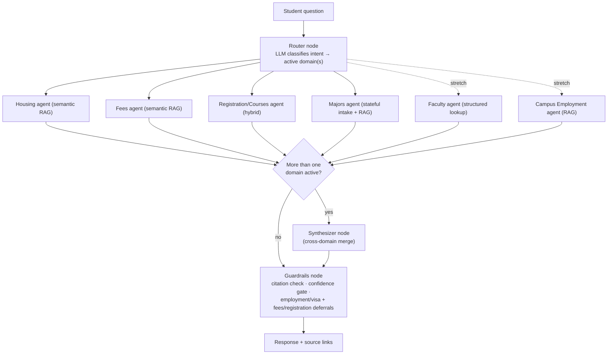

# TigerGuide — Project Plan (v3)

> v3: renamed the project, added Phase 0 (domain reconnaissance) that v2
> skipped, replaced the 1-week estimate with a realistic 2-3 week sequence,
> and broke the agent list into a concrete build-order table. Carries
> forward all v2 fixes: conditional synthesizer, extended guardrails,
> retrieval strategy, freshness handling, and the LangGraph gap checklist.
>
> Commit this as `PLAN.md` in the repo root. `CLAUDE.md` points here for
> full context — read the relevant phase section before starting work.

---

## 1. Why This Project

1. **Close the LangGraph gap.** The Integrated Patient System already has
   real multi-agent orchestration, but it's hand-rolled. This project builds
   the same pattern using an actual framework, so there's a second, honest
   data point for "I've used LangGraph in a real project" — not just "I
   understand the pattern."
2. **A useful tool for an actual audience** (University of Memphis
   students), which makes the eval/testing story concrete instead of
   synthetic.

Same instinct as the patient system: build something, test it against real
questions, find where it breaks, fix it, document the fix.

---

## 2. What Actually Has to Be True to Close the LangGraph Gap

Building the same specialist-per-domain + synthesizer shape already built by
hand, just in LangGraph syntax, teaches nothing new. See
`.claude/rules/langgraph-checklist.md` — these must be load-bearing, not
decorative:

- [ ] A checkpointer persists the Majors agent's intake state across turns.
- [ ] Conditional edges genuinely change the graph's shape based on router
      output.
- [ ] *(stretch)* `interrupt()` for a human-in-the-loop GPA/prereq check.

---

## 3. Domains / Agents

| Domain | Scope | Complexity | Retrieval type |
|---|---|---|---|
| **Housing** | Rates, hall types, contract policies, move-in/move-out dates | RAG lookup | Semantic |
| **Fees / Financial** | Fee charts, payment guidelines, financial aid budgets | RAG lookup | Semantic |
| **Registration / Courses** | Course catalog, registration/withdrawal procedures | RAG lookup | Hybrid (course codes = structured) |
| **Majors** *(flagship)* | Recommend majors from interests, declare vs. apply, eligibility | Stateful, multi-turn | Semantic |
| **Faculty** *(stretch)* | Directory: who teaches what, office hours | Structured lookup | Structured |
| **Campus Employment** *(stretch)* | What on-campus jobs currently exist | Simple RAG listing | Semantic |

### Why Majors is the flagship domain

A student either **declares** a major (near-automatic) or **applies** to one
(competitive pool, admission not guaranteed). Competitive majors need
specific prerequisites and a minimum GPA. The process is decentralized —
changing majors means contacting the *college* that owns the new major, not
one central office. `umdegree.memphis.edu` is the authoritative degree-audit
tool. This needs an intake step (interests, GPA, completed courses) held in
state across turns, which is what justifies LangGraph's state management.

---

## 4. Architecture

The router returns the *list* of active domains. The synthesizer fires only
when that list has more than one entry. Each specialist retrieves from a
domain-scoped Chroma collection filtered by `domain` metadata.

---

## 5. Retrieval Strategy

- **Structured lookup** (regex/keyword match before falling back to
  embeddings): course codes, faculty names.
- **Semantic RAG**: Housing, Fees, Registration procedures, Majors process
  text.
- **Registration is hybrid**: course-code queries go structured; "how do I
  withdraw" style questions go semantic.

---

## 6. Data Freshness

Fee amounts and deadlines change every semester. Every ingested chunk
carries `last_updated` metadata. Guardrails append a "confirm current
status" note to any answer citing a date or dollar amount. No automated
refresh for the MVP — document the manual refresh cadence in the README once
ingestion exists.

---

## 7. Real Data Sources

| Domain | Source |
|---|---|
| Housing | `memphis.edu/reslife` |
| Fees / Financial | `memphis.edu/usbs`, `memphis.edu/financialaid/consumer_info.php` |
| Registration / Courses | `catalog.memphis.edu` + Registrar procedures |
| Majors | Per-college advising pages + `umdegree.memphis.edu` |
| Faculty | Each department's public directory page |
| Campus Employment | Campus jobs portal / work-study postings |

---

## 8. Build Sequence

Realistic timeline: **2-3 weeks**, not one. Each phase is a natural
`/clear` boundary in Claude Code and a natural git branch (see
`.claude/rules/git-workflow.md`).

### Phase 0 — Domain Reconnaissance (2-3 days)

Before writing code, look at the actual data for each core domain (Housing,
Fees, Registration, Majors):

- Visit the source URL, note format (HTML/PDF/tables), size, update
  frequency.
- List 5-10 real questions a student would ask this domain.
- Note data complications (PDFs, nested tables, login walls, per-college
  variation).
- Propose a retrieval strategy with justification.

**Deliverable:** `docs/domain-research/{domain}.md` per core domain.

**Also in this phase:** build the eval skeleton — 5 rough Q&A pairs per core
domain in `eval/eval_set.csv` (`question, domain, expected_source_or_answer`).

### Phase 1 — Housing Vertical Slice (3-4 days)

Full pipeline on one domain: scrape → chunk → embed → retrieve → guardrail →
answer. Run the Phase 0 eval subset against it before moving on. This is the
go/no-go checkpoint — if this doesn't work cleanly, debug here before
replicating the pattern.

### Phase 2 — Fees & Registration (2-3 days each)

Repeat the proven Housing pipeline. Fees likely needs a PDF text extractor.
Registration needs the hybrid structured/semantic split.

### Phase 3 — Majors State Machine (3-4 days)

This is where the LangGraph gap checklist (Section 2) gets exercised: a
`StateGraph` with `{interests, gpa, completed_courses}` state, an intake
node, a checkpointer persisting state across turns, and a
declare-vs-apply recommendation node.

### Phase 4 — Router, Synthesizer, Guardrails (2-3 days)

Wire the built domains together: router → conditional synthesizer →
guardrails (extended to Fees/Registration deferrals, not just Employment).

### Phase 5 — Eval & Documentation (1-2 days)

Full eval pass across all built domains. Document what breaks — same rigor
as the patient system's retrieval-floor bug.

**Checkpoint rule:** if Phase 2 isn't done by the end of week 1 of actual
work, cut to Housing + Majors only rather than pushing 3+ domains forward
half-working.

---

## 9. Agent Build Order

| Agent | Does | Built in | Model |
|---|---|---|---|
| `domain-ingestor` (subagent) | Scrape → chunk → embed one domain | Phase 1-2 | Haiku |
| `housing-specialist` | RAG retrieval, Housing | Phase 1 | Sonnet |
| `fees-specialist` | RAG retrieval, Fees | Phase 2 | Sonnet |
| `registration-specialist` | Hybrid retrieval, Registration | Phase 2 | Sonnet |
| `majors-specialist` | Stateful intake + retrieval + declare/apply logic | Phase 3 | Sonnet |
| `router` | Classify question → active domains | Phase 4 | Opus (judgment call) |
| `synthesizer` | Merge multi-domain answers | Phase 4 | Sonnet |
| `guardrails` | Citation check, confidence gate, disclaimers | Phase 4 | Haiku |

Build one domain's specialist at a time. Don't wire the router until at
least two specialists exist and work independently.

---

## 10. How to Use This with Claude Code / Antigravity

- Work phase by phase. Give one phase, review the diff, run the eval
  subset, then move on.
- Each phase = one git branch (see `.claude/rules/git-workflow.md`).
- A good first prompt: *"Implement Phase 0 domain reconnaissance for
  Housing per PLAN.md Section 8. Write findings to
  docs/domain-research/housing.md. Don't write ingestion code yet."*

---

## 11. Resume / Portfolio Note

Don't add this to the resume until there's a working skeleton. The
differentiated story is an eval finding and a fix, not "built a chatbot
with LangGraph."
